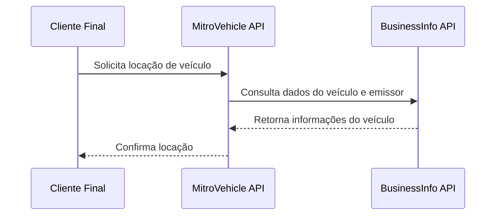

# 🚗 Projeto de Microsserviços — BusinessInfo e MitroVehicle

Este repositório contém a **documentação e integração entre os microsserviços** que compõem a arquitetura do sistema de locação de veículos.

---

## 🧭 Visão Geral

O sistema é formado por dois serviços principais:

| Microsserviço        | Função                                                                                               |
| -------------------- | ---------------------------------------------------------------------------------------------------- |
| **BusinessInfo API** | Responsável pelo **cadastro de emissores** e pela **gestão da frota de veículos**.                   |
| **MitroVehicle API** | Responsável pela **locação de veículos** para o cliente final, consultando os dados do BusinessInfo. |

Esses serviços se comunicam via **HTTP REST** em formato **JSON**, com autenticação **JWT** (em implementação futura).

---

## 🔗 Diagrama de Integração

---

## 🧠 Tecnologias Utilizadas

* .NET 6 / .NET 7
* Dapper / Entity Framework Core
* SQL Server
* AutoMapper
* MediatR (CQRS)
* Swagger
* Docker
* Azure / GitHub Actions

---

## ⚙️ Estrutura de Configuração

---

## 🧾 Fluxo de Deploy

1. **Commit** em branch `feature/...`
2. **Pull Request** para `master`
3. **Build** automático via GitHub Actions
4. **Deploy** em Kubernetes

---

## 📚 Wiki e Documentação Completa

A documentação detalhada com diagramas, endpoints e fluxo técnico está disponível na [Wiki do Projeto](../../wiki).

---
